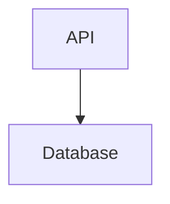

## Statement

The billing service is decomposed into an API container and a Database container.

<!-- forge:diagram id=DIAG-001 src=docs/forge/kb/architecture/views/containers.mmd -->

<!-- /forge:diagram -->

## Rationale

See ADR-0001 for the container split.

## Implications

Any new container must be reflected in `components.yaml` and regenerated here.

## Verification

Run `forge diagram validate -C fixtures/diagram-drift`.
