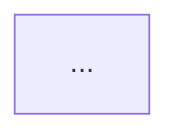

# 08 — The Knowledge Body (Project Memory)

## 8.1 Purpose

The Knowledge Body (KB) is the durable, structured, queryable answer to *"what is true about this
project and why."* It is what makes agent decisions consistent across sessions, across roles, and
across months.

**Design stance:** the KB is a *curated, schema'd knowledge base*, not a transcript archive and not a
vector-blob. Every entry is: identified, typed, owned, dated, sourced, confidence-rated, and linked —
and, where it describes structure, **drawn**. Diagrams are validated artifacts on equal footing with
prose; see §8.11, which is normative for notation, placement, generation and gate checks.

## 8.2 Location and layout

Root: `<project>/docs/forge/kb/` (configurable via `paths.kb`).

```
docs/forge/kb/
├─ index.md                       generated: table of contents + counts + health
├─ glossary.md                    ubiquitous language; term → definition → source
├─ product/
│  ├─ problem.md                  problem statement, who hurts, how much
│  ├─ users.md                    personas, jobs-to-be-done
│  ├─ capabilities.md             capability list (CAP-###) with IDs
│  ├─ metrics.md                  success metrics tree, targets, instrumentation
│  └─ scope.md                    in/out of scope, explicit non-goals
├─ constraints/
│  ├─ business.md                 budget, deadlines, team, buy-vs-build stance
│  ├─ technical.md                mandated stacks, existing systems, forbidden tech
│  ├─ regulatory.md               GDPR/HIPAA/PCI/residency, audit needs
│  └─ operational.md              SLOs, support model, on-call reality, environments available
├─ architecture/
│  ├─ architecture-spec.md        the canonical system description
│  ├─ components.md               component inventory: responsibility, owner, deps, failure modes
│  ├─ interfaces.md               index of interface contracts (details in specs/interfaces/)
│  ├─ patterns.md                 chosen patterns + where they apply + where they must NOT
│  ├─ nfr.md                      non-functional requirements with numbers and how they're verified
│  └─ views/                      C4-ish views as Mermaid: context, container, component, sequence
├─ domain/
│  ├─ domain-model.md             entities, aggregates, invariants
│  ├─ context-map.md              bounded contexts + relationships (DDD, when applicable)
│  └─ workflows.md                core business processes and state machines
├─ data/
│  ├─ data-model.md               logical model: entities, attributes, relationships, keys
│  ├─ stores.md                   physical stores, why each, what lives where
│  ├─ consistency.md              consistency/CAP posture per store & per operation
│  ├─ access-patterns.md          read/write patterns, cardinalities, hot paths, caching
│  ├─ lifecycle.md                retention, archival, deletion, PII classification
│  └─ migrations.md               migration strategy, tooling, backfill/rollback rules
├─ delivery/
│  ├─ repo-strategy.md            monorepo/polyrepo/meta, layout, ownership
│  ├─ build.md                    build system, reproducibility, artifacts, versioning
│  ├─ environments.md             env matrix, config strategy, secrets, parity
│  ├─ pipeline.md                 CI/CD stages, gates, promotion, rollback
│  └─ release.md                  release process, versioning, changelog, feature flags
├─ ops/
│  ├─ observability.md            logs/metrics/traces, stack, conventions, dashboards
│  ├─ runbooks/                   per-failure runbooks
│  ├─ slo.md                      SLIs/SLOs/error budgets, alerts
│  └─ security-ops.md             secret rotation, patching, incident process
├─ engineering/
│  ├─ standards.md                language/style/lint, error handling, logging conventions
│  ├─ testing.md                  test strategy summary (detail in specs/test-plan)
│  ├─ definition-of-done.md       DoR/DoD used by gates
│  └─ ways-of-working.md          branching, commits, review, autonomy policy
├─ decisions/
│  ├─ ADR-0001-....md
│  └─ index.md                    generated ADR index with status + supersession chain
├─ assumptions.md                 ASM-### open assumptions with validation triggers
├─ risks.md                       RISK-### register with likelihood/impact/mitigation/owner
└─ open-questions.md              OQ-### unanswered questions blocking or shadowing work
```

**Rule:** the KB never contains code, secrets, or transcripts. It contains *decisions and facts*.
Transcripts live in `.forge/state/`, session records in `docs/forge/sessions/`.

## 8.3 Entry format

Every KB file is Markdown with YAML front matter conforming to `kb-entry.schema.json`.

```markdown
---
id: KB-ARCH-0007
type: knowledge            # knowledge | adr | risk | assumption | open-question | glossary
section: architecture
title: Asynchronous work execution strategy
status: active             # draft | active | superseded | deprecated
confidence: high           # low | medium | high | verified
owner: architect
sources:                   # provenance is mandatory
  - kind: decision
    ref: ADR-0011
  - kind: human
    ref: "elicitation 2026-03-04, stage MVP"
  - kind: code
    ref: "src/worker/queue.ts@a1b2c3d"
created: 2026-03-04
updated: 2026-03-11
verified: 2026-03-11       # last time this was checked against reality
review_by: 2026-06-11      # staleness trigger
supersedes: []
superseded_by: null
related: [ KB-DATA-0003, ADR-0011, NFR-0004 ]
diagrams: [ DIAG-014, DIAG-022 ]     # standalone diagrams that clarify this entry (see §8.11)
tags: [ async, queue, reliability ]
applies_to: [ component:worker, component:api ]
---

## Statement
<one-paragraph, unambiguous statement of what is true>

## Rationale
<why — referencing ADRs and constraints>

## Implications
<what this forces or forbids downstream>

## Verification
<how an agent can check this is still true: a command, a file, a test>
```

`Verification` is required for `confidence: verified` entries and is what makes drift detection
possible: `forge kb lint --verify` runs these checks.

## 8.4 ADRs

`adr.schema.json`, file `decisions/ADR-{seq:04d}-{slug}.md`.

```markdown
---
id: ADR-0011
title: Use PostgreSQL as the primary transactional store
status: accepted           # proposed | accepted | rejected | superseded | deprecated
category: data             # product | architecture | data | delivery | ops | security | process
deciders: [ data-architect, architect, human ]
date: 2026-03-05
reversibility: medium      # trivial | easy | medium | hard | one-way
blast_radius: [ data, api, worker ]
revisit_trigger: "write throughput > 5k tps sustained, or multi-region requirement appears"
supersedes: []
superseded_by: null
related: [ NFR-0002, KB-DATA-0001 ]
diagrams: [ DIAG-009 ]            # required for structural/data ADRs (see §8.11.3)
framework: data-store-selection   # which decision framework produced this
---

## Context
<forces: requirements, constraints, NFRs — each citing an ID>

## Options considered
| Option | Pros | Cons | Fit score | Killer risk |
|---|---|---|---|---|
| PostgreSQL | … | … | 0.86 | … |
| DynamoDB | … | … | 0.62 | … |
| MongoDB | … | … | 0.55 | … |

## Decision
<what we chose, stated as a commitment>

## Diagram
<before/after or topology diagram, in the project's configured notation, with a caption and an
alt-text summary. Required for `category: architecture|data` and for any ADR whose `blast_radius`
names more than one component — see §8.11.3. Use a generator if one exists rather than drawing by
hand.>

## Consequences
### Positive
### Negative / accepted costs
### Follow-on work
<links to created stories/tasks>

## Reversal plan
<what it would take to undo this, and the trigger to consider it>
```

**Normative rules:**
- Every technology choice, structural choice, and process choice with a plausible alternative MUST
  have an ADR. "We used X" without an ADR is a gate failure at `G-Design`.
- `reversibility: one-way` ADRs always require human approval regardless of autonomy level.
- Superseding an ADR MUST update the superseded one's front matter and trigger a KB consistency scan
  of everything `related`.

## 8.5 Indexing and retrieval

`@forge/kb` maintains a derived index in `.forge/state/index.db` (rebuildable):

| Table | Contents |
|---|---|
| `entries` | id, type, section, title, path, status, confidence, updated, hash |
| `links` | from_id, to_id, kind (`related`, `supersedes`, `applies_to`, `derived_from`, `cites`) |
| `terms` | FTS5 index over statement + rationale + title (BM25) |
| `symbols` | code symbols ↔ KB entries (populated by brownfield ingestion and by code-writing steps) |
| `usage` | which run/step read or wrote which entry |

**Retrieval strategy — lexical-first, deliberately:**

1. **Structural** (primary): the step declares required inputs; those are fetched by ID. Most
   retrieval is structural, not semantic — this is the single biggest quality lever.
2. **Lexical** (BM25/FTS5) over the step brief's salient terms + glossary expansion.
3. **Graph expansion**: pull entries linked to the structurally-required ones (1 hop, filtered by
   type and recency).
4. **Optional embeddings**: `kb.retrieval.embeddings: true` enables a local embedding index. If
   enabled, the provider is configurable and must run locally or via the adapter; embeddings are a
   *supplement* to (1)–(3), never a replacement. Off by default — no network dependency for core
   function.
5. **Re-rank + budget**: cap at `kb.packBudgetTokens` (default 20 000), always keeping pinned core.

Every packed entry carries its ID in the prompt so agents can cite and so `forge kb usage` can show
which knowledge actually drove which decision.

## 8.6 Writing to the KB

Three paths:

- **Direct write** — agent owns the section (per `kb_write` in its definition) and autonomy allows.
  Still goes through `KbWriter`, which validates schema, checks contradictions, updates `updated`,
  and appends an event.
- **Declared output** — a lane's `agent` step that declares a KB artifact type in its `outputs` (`06`
  §6.7) writes that entry directly, as a file, on the lane: an agent writes files, not API calls, so
  this is not a `KbWriter` call. The engine's output check (`18` §18.7) binds the file to the same
  invariants below instead. Any other KB change the lane makes goes through the proposal channel, not
  as a direct write, whatever the step's autonomy.
- **Proposal** — everything else. `KbProposal` artifact with a diff, rationale, and target. Routed to
  the owning agent (auto-adjudicated at `autonomous` if the owner agrees) or the human.

`KbWriter` invariants:
- Schema-valid front matter or reject.
- IDs are allocated centrally and monotonically; never reused (deleted entries become `deprecated`,
  files retained).
- Every write records `sources`. A write with no source is rejected.
- Writes are serialised; concurrent proposals to the same entry are queued and the second is rebased
  onto the first (with a conflict escalation if the statement changed).

These invariants bind every path: a direct write is checked by `KbWriter` itself, and a declared
output is checked to the same rules by the output contract that verifies the lane instead.

## 8.7 Integrity: the KB linter

`forge kb lint` (also a gate check `kb:lint`) enforces:

| Rule | Severity |
|---|---|
| Front matter valid against schema | error |
| Referenced IDs exist (`related`, `supersedes`, `applies_to`) | error |
| No dangling supersession chains; no cycles | error |
| **Contradiction detection**: two `active` entries in the same section making opposing claims about the same `applies_to` subject | error |
| ADR coverage: every component in `components.md` has ≥1 owning ADR | error at `G-Design` |
| Diagram rules (`diagram:*`, see §8.11.7): syntax, required coverage, ADR diagram coverage, node references, captions, drift, transclusion | error / warn per §8.11.7 |
| Every `CAP-###` has ≥1 downstream epic (or is explicitly deferred) | warn → error at `G-Ready` |
| Staleness: `review_by` in the past | warn |
| `confidence: low` entries used as inputs to accepted ADRs | warn |
| Verification commands present for `confidence: verified` | error |
| Orphan entries: no inbound links and not in a root section | warn |
| Glossary drift: terms used in specs but absent from glossary | warn |

**Contradiction detection implementation:** deterministic checks first (same `applies_to` +
mutually-exclusive tag pairs from a curated antonym set, e.g. `sync`/`async`,
`monolith`/`microservices`, `strong-consistency`/`eventual-consistency`; conflicting ADR statuses;
two ADRs both `accepted` in the same `category` + `applies_to` scope without a supersession link).
An LLM pass may then flag *semantic* contradictions as **warnings requiring human confirmation** —
never as automatic errors. LLM-only findings never fail a gate.

## 8.8 Staleness and drift

- `review_by` defaults per section (architecture 90 d, data 90 d, delivery 60 d, product 120 d).
- `forge kb verify` runs every entry's `Verification` command/check and updates `verified` or flags.
- **Code drift**: entries with `applies_to: component:*` are re-checked when the component's files
  change beyond a threshold; a drift report is produced and the entry is marked `needs-review`.
  This runs as a post-merge check.
- Drift and staleness surface on the Home screen and in `G-Design` as warnings.

## 8.9 KB in the human's hands

- Everything is Markdown — readable on GitHub, diffable in PRs, editable in any editor.
- Human edits are detected via content hash; `forge kb sync` re-indexes, re-lints and asks about
  anything that now contradicts.
- `forge kb graph` emits a Mermaid graph of entries and links for embedding in docs.
- Diagrams render in place on GitHub/GitLab and in most wikis, so a reviewer sees the architecture in
  the pull request rather than having to open a separate tool (§8.11.2).
- **Export hooks** (post-v1, designed for now): `docs/forge/kb` → Confluence/Notion/Backstage via an
  exporter interface `KbExporter { push(entries): Promise<Result> }`. v1 ships `markdown-bundle` and
  `html` exporters and the interface, so external systems are an implementation detail later.

## 8.10 What the KB is *not* allowed to become

- Not a dumping ground for meeting transcripts (sessions have their own store; only *decisions*
  graduate to the KB).
- Not duplicated truth: if a fact is derivable from code and checkable, the KB entry stores the
  *decision and the check*, not a copy that will rot.
- Not unbounded: `forge kb lint` warns above configurable size thresholds per section, forcing
  consolidation. A KB nobody can pack into context is a KB nobody uses.
- Not a gallery: diagrams exist to remove ambiguity from a decision, not to decorate it. A diagram
  with no `explains` link and no prose counterpart is flagged as decoration and removed.

---

## 8.11 Diagrams as first-class knowledge

### 8.11.1 Principle

> **If a decision has structure, it gets drawn.** Prose alone cannot carry topology, sequence, state
> or cardinality without ambiguity — and ambiguity is exactly what the next agent will resolve badly.

Diagrams in FORGE are **artifacts, not illustrations**. They are:

- **text-based and diffable** — the source lives in the repo, reviewable in a pull request;
- **authored by agents** — the notation must be one an LLM writes fluently and correctly;
- **validated** — syntax-checked, lint-checked, and reference-checked against the KB in CI;
- **generated where possible** — derived from structured artifacts so they cannot drift;
- **never the sole carrier of meaning** — every diagram is paired with prose that states the same
  thing, for accessibility, for text-only agent contexts, and because a diagram nobody can explain
  is usually a diagram nobody understood.

Binary images (PNG, JPG), external SaaS boards (Miro, Lucidchart, Figma diagrams) and editor-specific
formats are **not permitted as sources of truth** in the KB. They may be *linked* as references with
a note, but the canonical version is text. This is non-negotiable: an agent cannot read, validate, or
update a PNG, so a PNG-based KB rots the moment the first agent touches the system.

### 8.11.2 Notation decision

| Notation | Role | When |
|---|---|---|
| **Mermaid** | **Default and strongly preferred** | Everything, unless it demonstrably cannot express the diagram |
| **PlantUML** (incl. C4-PlantUML) | Secondary, opt-in | Rich C4 models, complex deployment diagrams, advanced sequence features Mermaid lacks |
| **D2** | Optional, opt-in | Teams that already use it; strong auto-layout for large topologies |
| **Graphviz / DOT** | Generated only | Machine-generated graphs (dependency graphs, spec graph, call graphs) |
| **Structurizr DSL** | Optional, L4 | Organisations already maintaining a formal C4 model |
| **ASCII / box-drawing** | Fallback | Tiny diagrams inline in terminal-facing docs and TUI views |

**Why Mermaid is the default** — the reasoning is recorded, because implementers will be tempted to
swap it:

1. It renders natively in GitHub, GitLab, VS Code, Obsidian, Notion and most wikis, so the KB stays
   readable with zero tooling in the place people actually read it.
2. It is heavily represented in model training data, so agents author it correctly at a much higher
   rate than PlantUML or D2 — this is a *quality* argument, not a convenience one.
3. It parses in pure JavaScript with no browser and no server, so validation is cheap enough to run
   on every gate.
4. It degrades gracefully: an unrenderable Mermaid block is still readable as structured text.

Only one notation is *required*. The others are configuration (see §8.11.9), and a project may forbid
all but Mermaid.

### 8.11.3 Diagram taxonomy — what to draw, and when

This table is normative. The gate checks in §8.11.7 enforce the **Required** column.

| Purpose | Notation kind | Lives in | Required |
|---|---|---|---|
| System context (who uses it, what it talks to) | `C4Context` / `flowchart` | `architecture/views/context.mmd` | L2+ at `G-Design` |
| Container / deployable decomposition | `C4Container` / `flowchart` | `architecture/views/containers.mmd` | L2+ at `G-Design` |
| Component internals of a container | `C4Component` / `flowchart` | `architecture/views/component-<name>.mmd` | L3+ for each container with >3 components |
| Runtime interaction / request path | `sequenceDiagram` | inline in the ADR or `architecture/views/seq-<flow>.mmd` | Every cross-boundary flow ≥2 hops |
| Async / event flow, retries, DLQ | `sequenceDiagram` + `flowchart` | `architecture/views/async-<flow>.mmd` | Every async path |
| Entity relationships | `erDiagram` | `data/views/er-<context>.mmd` | Whenever persistent state exists |
| Entity / order / job lifecycle | `stateDiagram-v2` | `domain/views/state-<entity>.mmd` | Every entity with >2 states |
| Business process | `flowchart` | `domain/views/process-<name>.mmd` | L2+ per core process |
| Bounded contexts & relationships | `flowchart` (context map) | `domain/context-map.mmd` | When DDD is adopted |
| Data pipeline / lineage | `flowchart LR` | `data/views/pipeline-<name>.mmd` | Module `fm-data` |
| Deployment topology & environments | `flowchart` / `C4Deployment` | `delivery/views/deployment-<env>.mmd` | L2+ at `G-Deliver` |
| CI/CD pipeline stages & gates | `flowchart LR` | `delivery/views/pipeline.mmd` | L2+ at `G-Deliver` |
| Trust boundaries & threats | `flowchart` with boundary subgraphs | `architecture/views/threat-model.mmd` | Whenever a threat model exists |
| Migration / cutover plan | `flowchart` + `gantt` | `data/views/migration-<id>.mmd` | Every expand-contract migration |
| Delivery stages & dependencies | `gantt` / `flowchart` | `plans/views/stages.mmd` | L2+ |
| Spec traceability graph | `flowchart` (generated) | `specs/views/traceability.mmd` | Generated |
| Run plan DAG | `flowchart` (generated) | generated per run | Generated |
| Decision option comparison | `flowchart` / `quadrantChart` | inline in the ADR | Optional |

**Coverage rule:** an ADR whose `blast_radius` names more than one component, or whose category is
`architecture` or `data`, MUST contain or reference at least one diagram. An ADR that changes a
structure without showing the before and after is failing at its job.

### 8.11.4 Placement: inline vs standalone

| | Use | Mechanism |
|---|---|---|
| **Inline** | ≤ ~15 nodes, specific to one artifact, not reused | A fenced ```mermaid block directly in the Markdown |
| **Standalone** | Large, reused across artifacts, or generated | A `.mmd` file under `<section>/views/`, transcluded into artifacts |

Transclusion uses an explicit, greppable marker that survives round-tripping:

```markdown
<!-- forge:diagram id=DIAG-014 src=architecture/views/containers.mmd -->

<!-- /forge:diagram -->
```

`forge diagram sync` expands markers into up-to-date fenced blocks so the rendered Markdown is
self-contained on GitHub, while the `.mmd` file remains the single source of truth. A transcluded
block whose content differs from its source is a lint error (`KB-031`), not a silent inconsistency.

### 8.11.5 The Diagram artifact

Standalone diagrams carry a sidecar `.mmd.yaml` (or front matter in a `.md` wrapper):

```yaml
id: DIAG-014
title: Container decomposition — billing platform
kind: C4Container            # from the taxonomy above
notation: mermaid            # mermaid | plantuml | d2 | dot | structurizr
source: architecture/views/containers.mmd
generated: true              # true → produced by a generator; never hand-edited
generator: forge:components-to-c4
depicts:                     # every node should resolve to a real KB/spec entity
  - component:api
  - component:worker
  - component:web
  - datastore:postgres-primary
explains: [ ADR-0011, ADR-0013, KB-ARCH-0007 ]
caption: >
  The MVP topology: a single API deployable, a worker sharing the same image, and one Postgres
  instance. The queue is a Postgres table, not a broker — see ADR-0013 for the extraction trigger.
alt_text: >
  Three boxes — web, API, worker — all connecting to one PostgreSQL database; the worker reads jobs
  from a table in that same database.
owner: architect
created: 2026-03-05
verified: 2026-03-11
review_by: 2026-06-11
```

`caption` and `alt_text` are **required**. `alt_text` is what gets packed into an agent's context when
the diagram source itself is too large to include — a summarised diagram is far more useful to a
downstream agent than a truncated one.

### 8.11.6 Generated diagrams and drift

Diagrams that can be derived MUST be derived. Generators shipped in `@forge/diagrams`:

| Generator | Source of truth | Output |
|---|---|---|
| `components-to-c4` | `architecture/components.md` | Context + Container + Component views |
| `interfaces-to-sequence` | `specs/interfaces/*` + declared flows | Sequence diagrams per flow |
| `datamodel-to-er` | `DM-###` artifacts | ER diagram per bounded context |
| `schema-introspect-to-er` | A live/dev database or migration files | ER diagram reflecting *actual* schema |
| `specgraph-to-graph` | The spec graph | Traceability graph |
| `workflow-to-dag` | Workflow definitions | Run plan DAG |
| `deps-to-graph` | Code dependency analysis (brownfield) | Module dependency graph |
| `pipeline-to-flow` | CI config | Pipeline stage flow |

**Drift rule:** for every `generated: true` diagram, a check regenerates it and compares. A mismatch
means the diagram and its source have diverged, and this is one of the cheapest, highest-signal drift
detectors FORGE has — because it catches *architecture drift* (the code grew a component nobody
recorded) rather than just documentation rot. Behaviour is configurable: `fail` (default at
`G-Design`), `autofix` (regenerate and commit), or `warn`.

The `schema-introspect-to-er` generator is worth calling out: comparing the ER diagram derived from
the *designed* data model against the one derived from the *actual* database is a direct,
deterministic answer to "did we build what we designed?"

### 8.11.7 Validation and gate checks

`forge diagram validate` (also the `diagram:*` gate checks):

| Check id | Rule | Severity |
|---|---|---|
| `diagram:syntax` | Every diagram parses in its declared notation | error |
| `diagram:required` | Taxonomy coverage per §8.11.3 for the current level and gate | error |
| `diagram:adr-coverage` | Structural ADRs contain or reference ≥1 diagram | error at `G-Design` |
| `diagram:refs` | Every node in `depicts` resolves to a real component, datastore, entity or actor | error |
| `diagram:orphan-nodes` | No node is unreferenced by any edge (usually a typo) | warn |
| `diagram:complexity` | ≤ 20 nodes and ≤ 30 edges per diagram; beyond that, split into layered views | warn → error at 40 |
| `diagram:label-quality` | No empty, single-letter, or placeholder labels (`foo`, `TODO`, `Component1`) | error |
| `diagram:caption` | `caption` and `alt_text` present and non-trivial | error |
| `diagram:drift` | Generated diagrams match regeneration output | error at `G-Design` |
| `diagram:transclusion` | Inline copies match their `.mmd` source | error |
| `diagram:staleness` | `review_by` not in the past | warn |
| `diagram:render` | Renders without error to SVG | error (when rendering is enabled) |

The complexity budget matters more than it looks. A 60-node diagram is unreadable to a human *and*
consumes context an agent needs for reasoning. Forcing a split into layered views is a design
discipline, not a formatting preference.

### 8.11.8 Rendering pipeline

Two paths, deliberately separated so that the common path needs no heavy dependency:

1. **Validate-only (default, always available).** Parse Mermaid with the pure-JS parser — no browser,
   no network, no Puppeteer. This is what runs in gates and CI. Rendering is *not* required to
   validate.
2. **Render-on-demand (optional).** `forge diagram render` produces SVG into
   `docs/forge/reports/diagrams/`. Implementation order of preference:
   a. a local renderer if the optional dependency is installed;
   b. otherwise, emit self-contained HTML that renders client-side with a bundled Mermaid script —
      **this is the default fallback and requires no extra install and no network at render time**;
   c. never a hosted rendering service by default (a KB diagram may encode internal architecture;
      shipping it to a third-party renderer is a data-egress decision the user must opt into
      explicitly via `diagrams.remoteRenderer`).

`forge export html` embeds rendered or client-rendered diagrams so the exported KB is a browsable
document. `forge export markdown-bundle` leaves Mermaid fenced blocks intact, since the target
platforms render them natively.

Theming follows the project style profile (light/dark pair, colour-blind-safe palette, consistent
shape semantics: rectangle = service, cylinder = datastore, hexagon = external system, dashed = async).
Shape semantics are declared in `diagrams.legend` and a legend is auto-appended to standalone views.

### 8.11.9 Configuration and customization

This is customization surface **C16** (see `15` §15.1); it follows the same layering, provenance and
upgrade-safety rules as every other surface.

```yaml
# .forge/config.yaml
diagrams:
  defaultNotation: mermaid
  allowedNotations: [ mermaid, plantuml ]     # d2/dot/structurizr disabled for this project
  render: on-demand                            # never | on-demand | on-gate
  remoteRenderer: null                         # explicit opt-in only; null = no egress
  complexity: { maxNodes: 20, maxEdges: 30, hardMaxNodes: 40 }
  driftPolicy: fail                            # fail | autofix | warn
  requireCaptions: true
  legend:
    service: rect
    datastore: cylinder
    external: hexagon
    async: dashed
  theme: { light: neutral, dark: dark, palette: colorblind-safe }
  taxonomyOverrides:                           # tighten or relax the required-diagram table
    - kind: C4Component
      required: never
```

Projects standardised on PlantUML or D2 can flip `defaultNotation` and every agent, template and
generator follows — generators declare output for each supported notation, and a generator lacking
the configured notation falls back to Mermaid with a recorded warning rather than failing.

### 8.11.10 Agent obligations

Added to the FORGE operating contract (`05` §5.5) as rule 11:

> **11. Draw the structure.** When your output describes topology, sequence, state, or relationships,
> include a diagram in the project's configured notation, with a caption and an alt-text summary. If
> a generator exists for that diagram, invoke it rather than drawing by hand. Keep any single diagram
> under the project's node budget — split into layered views instead of producing one unreadable
> picture.

Supporting skills shipped in the built-in library (`15` §15.4.4):

| Skill | Teaches |
|---|---|
| `mermaid-authoring` | Correct syntax per diagram kind, common parse failures, escaping labels, layout direction, subgraphs |
| `c4-diagramming` | Choosing the right C4 level, what belongs at each, avoiding the "everything box" |
| `sequence-diagramming` | Modelling failure paths, timeouts, retries and async gaps — not just the happy path |
| `er-diagramming` | Cardinality and optionality notation, when to show attributes vs elide them |
| `state-diagramming` | Total state coverage, illegal transitions, terminal states |
| `diagram-review` | Reviewing a diagram against the code and the KB rather than for prettiness |

The `sequence-diagramming` skill is specifically about failure paths, because agents reliably draw
the happy path and stop — and the failure path is where the design decisions actually live.

### 8.11.11 Diagrams in the TUI and in review

- The TUI cannot render images reliably across terminals, so the KB browser shows the **diagram
  source** plus its caption and alt text, with `o` to open a rendered SVG/HTML in the default browser.
  Where the terminal advertises an inline-graphics protocol, the TUI MAY render inline; this is a
  progressive enhancement and never a requirement.
- `forge diagram list | show <id> | render | validate | sync | generate <generator> | diff <id>` is
  the command surface. `forge diagram diff` renders the before/after of a structural change, which is
  what makes architecture changes reviewable in a pull request.
- Review agents receive diagram source in context for structural changes, and the `reviewer` role's
  perspective set includes checking that the diagram, the prose and the code agree — a three-way
  disagreement is a blocking finding.
